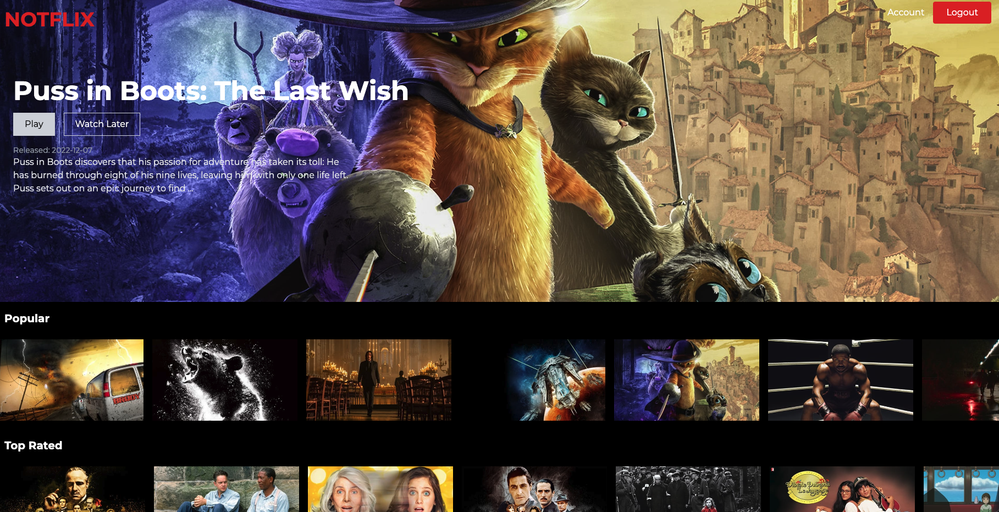
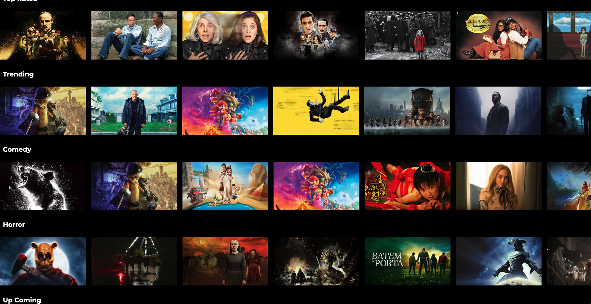
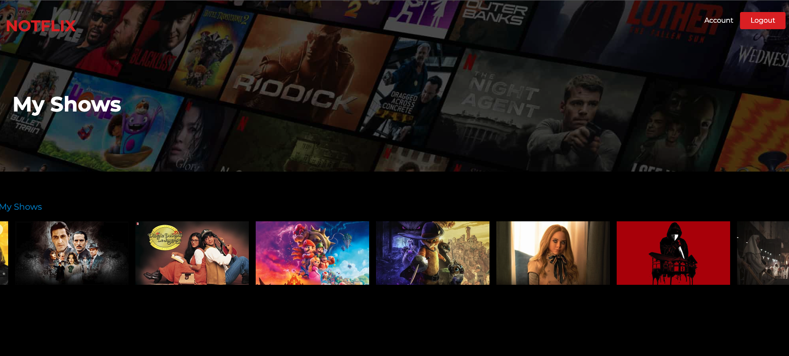
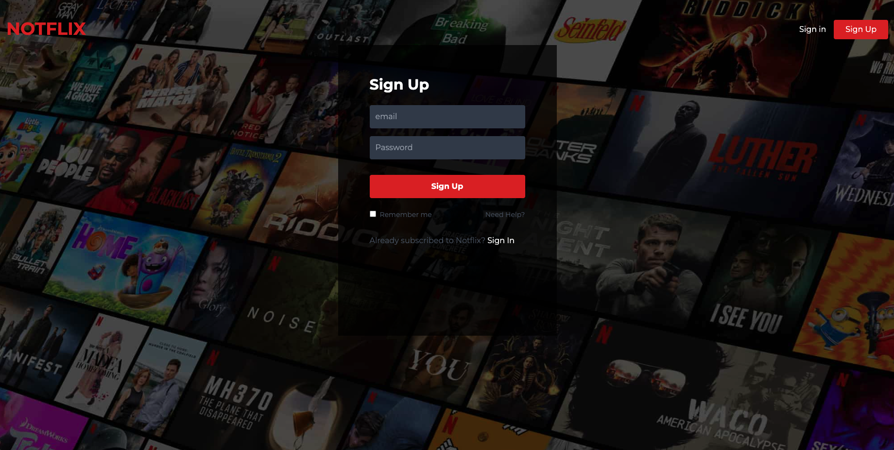

# NOTFLIX

Notflix is a Netfix clone that uses React and The Movie Database API to allow the user to sign-in and 'like' movies to their account. 


### Table of Contents
- [NOTFLIX](#notflix)
    - [Table of Contents](#table-of-contents)
  - [Description](#description)
  - [Installation](#installation)
  - [Screenshots](#screenshots)
  - [Author](#author)
  - [Links](#links)
  - [Acknowledgements](#acknowledgements)

## Description

Who doesn't love movies?  I know I do, and while trying to find an awesome application to put in my portfolio and LinkedIn profile, I came across some Netflix clone apps, so I decided to create my own.  I wanted an amusing name, so I came up with Notflix as, not only is it ***NOT*** Netflix, it is an app, specifically because it uses The Movie Database, the user actually ***CANNOT***
view movies.  LOL🤣&nbsp;&nbsp;  This is because TMDB does not allow that option using their **Free** API.  The user can, however, sign up or log in if they have already signed in, and then they are presented with a random movie image, title, release date and description.  Under this, there are more movie options with the same type of slidebar Netflix uses.  Users can then 'favorite' the movies they choose, as well as delete their favorites by using the heart on the left of the movie to 'favorite', and then the X on the right of a movie they had made a 'favorite' in the past.  These movies that were made 'favorites' can be viewed in the user's account page.  The backend database is hosted by firebase, which is a cloud based mobile and web application development platform.

## Installation

To install and run this app on your local machine, please follow these steps:

1. Clone the repository:<br>
   ```git clone https://github.com/Dpro03/notflix.git```

2. Install dependencies:<br>
   ```cd notflix```<br>
   ```npm install```

3. Create a Firebase project:<br>
   If you haven't already, create a new Firebase project on the Firebase console:<br> https://console.firebase.google.com/   

4. Set up Firebase config:<br>
   Copy the Firebase configuration values for your project from the Firebase console, and create a `.env` file in the root of your project with the following environment variables:<br>    
   `REACT_APP_FIREBASE_API_KEY=<your-api-key>`<br>
   `REACT_APP_FIREBASE_AUTH_DOMAIN=<your-auth-domain>`<br>
   `REACT_APP_FIREBASE_PROJECT_ID=<your-project-id>`<br>

   Replace `<your-api-key>`, `<your-auth-domain>`, and `<your-project-id>`<br> with the corresponding values for your Firebase project.

5. Start the development server:<br>
   ```npm start```

6. Access the app:<br>
   Open your web browser and navigate to `http://localhost:3000` to access the app.<br>

   That's it! You should now have the app up and running on your local machine.<br> If you have any issues or questions, please feel free to contact me [here.](mailto:dpro308@gmail.com)


## Screenshots


***


***


***



## Author

My name is David Proto, a very recent full-stack web development boot camp graduate of the University of Connecticut.<br>

My GitHub account is [here.](https://github.com/Dpro03)

## Links 

See the deployed app by clicking on this link:  [Notflix!](https://notflix-react-8e862.web.app/)<br>

Here is a link to the GitHub Repository: [Repo](https://github.com/Dpro03/notflix.git)

## Acknowledgements

I would like to thank the Awesome YouTube Channel, Code Commerce, for their great tutorials on React, Tailwind CSS, and Firebase. I learned a lot from Clint's videos and was able to apply his techniques to my project.


   
      


